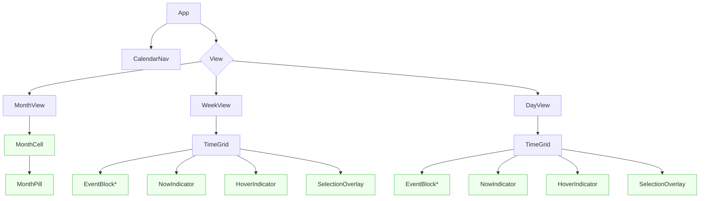
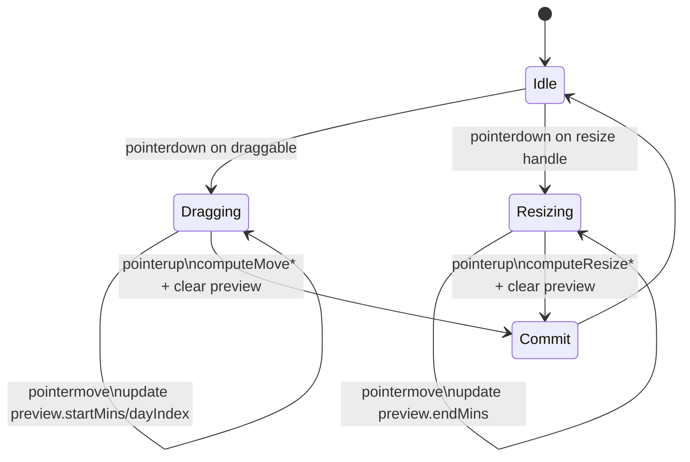
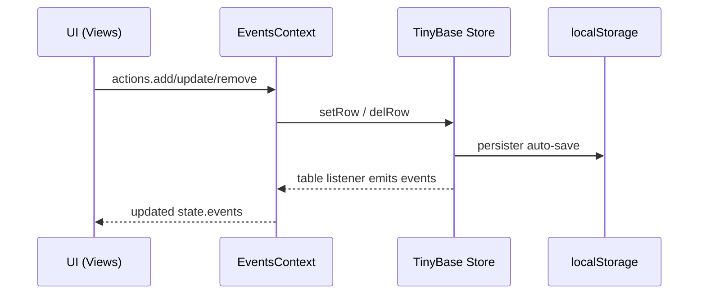
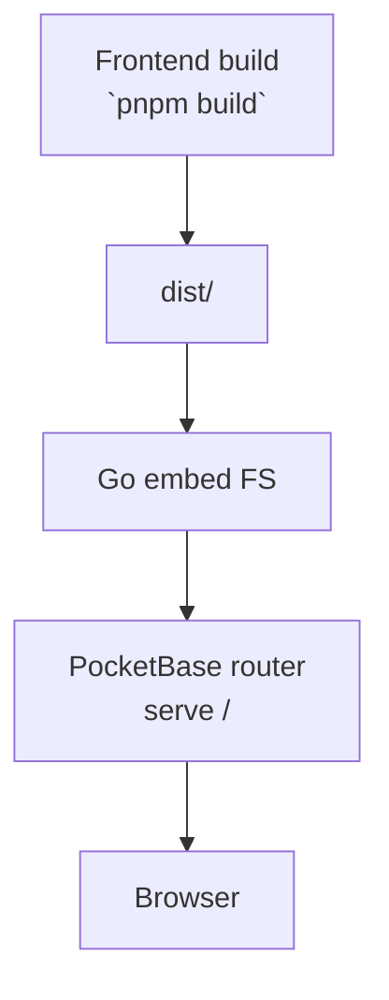

 # Schedule – SolidJS Calendar

A fast, keyboard-friendly calendar app built with SolidJS.
It supports Month/Week/Day views, drag & drop, recurring events (RRULE), filtering, reminders, and accessible interactions.

## Contents
- Features
- Quick start
- Scripts
- Architecture overview
- UI guide (views, interactions, shortcuts)
- Data model and persistence
- Implementation notes
- Testing
- Building and deploying
- Backend (PocketBase) server
- Troubleshooting
- Contributing

## Features
- Month / Week / Day views with smooth navigation
- Drag to move/resize events (Week/Day), with snapping to 15-min grid
- Click-and-drag to select time ranges and create events
- RRULE recurrence expansion with exdates (read-only series for now; occurrences render with source linkage)
- Filters: text search, category filter, color coding
- Reminders via browser Notifications (opt-in)
- Keyboard-friendly: roving focus in event lists and cells, arrow-key nudges, Enter to edit
- Accessible: focus styles, semantics, and minimized pointer-only assumptions

## Quick start
```sh
pnpm install
pnpm dev
# open http://localhost:5173
```

## Scripts
- dev: start Vite dev server
- build: type-check + Vite production build (outputs dist/)
- preview: serve the production build locally
- test: run unit tests with Vitest

## Architecture overview
The frontend lives in `src/` and is organized by feature:
- Components
	- `CalendarNav` – top navigation: prev/next, Today, week-start selector, view switcher
	- `MonthView`, `WeekView`, `DayView` – primary calendar views
	- `TimeGrid` – presentational 24h grid: labels, hover line, today tint, and “now” line
	- `EventBlock` – interactive event card used in Week/Day lanes
	- `MonthCell`, `MonthPill` – month grid day cell and tiny event capsules
	- `SelectionOverlay`, `HoverIndicator`, `NowIndicator` – shared visuals
- State and data
	- `context/EventsContext` – global state (events, view, filters) with actions
	- `data/db` – TinyBase-backed store persisted to localStorage
	- `utils/occurrence` – expand events (RRULE) into concrete occurrences + filtering
- Interaction helpers
	- `utils/timeGrid` – minutes↔pixels, constants (ROW_H, SNAP_MIN)
	- `utils/lanes` – greedy lane-assignment so overlapping events render side-by-side
	- `utils/eventUpdates` – pure time math for move/resize commits
	- `utils/dragPreview` – ephemeral preview state (visual only)
	- `utils/pointer`, `utils/autoScroll` – pointer capture and edge scrolling

## UI guide
### Month view
- Layout: 7 columns × 5–6 rows; each cell is a `MonthCell`
- Events render as `MonthPill`s; the current day is visually emphasized
- Drag & drop: move events between days; auto-scroll within day lists and viewport while dragging
- Keyboard: roving focus across cells; Enter to create default slot (noon+1h)

### Week view
- Layout: 7 day columns with a shared time axis
- Overlap handling: events assigned to lanes per day (no overlap within a lane)
- Interactions
	- Drag to move in time and across days; resize from bottom edge
	- Hover line shows snapped time; selection overlay creates a new event
	- Today column shows background tint and the live “now” line
	- Edge navigation: dragging near left/right edges jumps weeks (keeps overlay visible)
- Keyboard
	- Ctrl+ArrowUp/Down roving focus between events
	- ArrowUp/Down move start by SNAP_MIN (when on the start segment)
	- ArrowLeft/Right resize end by SNAP_MIN (when on the end segment)
	- Enter to edit, Delete/Backspace to remove

### Day view
- Layout: `TimeGrid` with one day column and absolutely positioned event blocks
- Interactions mirror Week view, but limited to the anchor day
- Today visuals handled by `TimeGrid` and `NowIndicator`

### Keyboard shortcuts (global)
- View: M (month), W (week), D (day)
- Navigate: ← / → move period (month/week/day); “Today” button to jump to today
- Inside views: see per-view section above

## Data model and persistence
### EventItem
```ts
type EventItem = {
	id: string
	title: string
	start: string // ISO datetime
	end: string   // ISO datetime
	allDay?: boolean
	category?: 'College' | 'Personal' | 'Other'
	color?: string
	tags?: string[]
	location?: string
	notes?: string
	reminderMinutes?: number[]
	rrule?: string        // iCal RRULE for recurrence
	exdates?: string[]    // ISO datetimes excluded from recurrence
	parentId?: string     // detached single occurrence override
}
```

### Occurrences
`utils/occurrence.expandEventsForRange` expands recurring events into instances for a date range. Instances carry a `sourceId` that links to their series base. Non-recurring and detached overrides pass through as-is.

### Store
- `data/db` uses TinyBase with a localStorage persister (no server required for the frontend)
- `EventsContext` exposes CRUD and view/filter setters; components subscribe via context

## Implementation notes
- Time grid scale: `ROW_H = 64px` per hour, `pxPerMinute = ROW_H / 60`
- Snapping: `SNAP_MIN = 15`; all interactive minutes are snapped
- Lanes: greedy sweep-line ensures overlapping events never share a lane; touching events can
	reuse lanes
- Preview model: interactive motion updates an ephemeral preview map until pointer up, then one
	commit is dispatched; avoids jitter and keeps the UI responsive
- Today visuals: `TimeGrid` adds a header “Today” badge and a subtle background tint; `NowIndicator`
	owns its own timer and shows the red current-time line when appropriate

## How it works (deep dive)

### Rendering pipeline
1) Anchors and ranges
	 - Each view derives a date range from the anchor `viewDate` in `EventsContext`.
	 - Month: `monthGrid` generates all visible days; Week: `weekRange`; Day: `startOfDay`..`endOfDay`.
2) Occurrence expansion
	 - `utils/occurrence.expandEventsForRange(events, start, end)` returns concrete instances:
		 - Non-recurring: pass-through.
		 - Recurring: uses `rrulestr(ev.rrule, { dtstart })` and `between(startOfDay(start), endOfDay(end), true)`.
			 For each instance date `d`, create an occurrence `{ ...ev, id: `${ev.id}::${d.toISOString()}`, sourceId: ev.id, start: d, end: d + duration }` and skip any `exdates`.
		 - Detached overrides (`parentId`) are treated as standalone occurrences and not re-expanded.
3) Filtering
	 - `utils/occurrence.filterEvents` applies a case-insensitive text search over `title`, `tags`, `location`, `notes` and category allowlist.
4) Day clamping and segments
	 - For Week/Day, each occurrence is converted to a per-day segment: clamp the visual minutes to [00:00, 24:00] of that day while preserving the real `startISO`/`endISO` for edits.
	 - For Week: multi-day events produce a segment per day they overlap; flags `isStartSegment`/`isEndSegment` derive edit affordances.
5) Lane assignment
	 - `utils/lanes.assignLanes` takes `{id,startMins,endMins}` and greedily assigns lane indices so overlapping segments do not share a lane. Touching segments (end == start) can reuse a lane.
6) Rendering
	 - `EventBlock` receives absolute `top/height` and computed `left/width` from lane math.
	 - `TimeGrid` paints hour lines, "today" tint, hover indicator, and the `NowIndicator` when appropriate.

### Coordinate math and snapping
- Scale: `ROW_H = 64`, `pxPerMinute = ROW_H / 60` shared via `utils/timeGrid`.
- Convert pointer Y to minutes: `mins = (clientY - rect.top) / pxPerMinute`, then clamp and snap with `SNAP_MIN` (default 15 minutes).
- Convert minutes to pixels for rendering: `top = startMins * pxPerMinute`, `height = (endMins - startMins) * pxPerMinute`.

### Interactions engine
Core building blocks:
- Pointer capture wrappers: `utils/pointer.withPointer` (vertical) and `withPointer2D` (horizontal+vertical) handle capture, movement, and release callbacks.
- Preview store: `utils/dragPreview.createPreviewState` holds ephemeral overrides `{ startMins?, endMins?, dayIndex? }` per event base id. Visuals reflect preview instantly; on release we compute and commit a patch, then clear preview.
- Commit math: `utils/eventUpdates`
	- Day view: `computeMoveWithinDay` and `computeResizeWithinDay` operate on the anchor day and clamp minutes within [00:00, 24:00], ensuring min duration `SNAP_MIN` for resize.
	- Week view: `computeMoveToDay` and `computeResizeToDay` use the week start + target `dayIndex` to build new ISO datetimes and enforce invariants.
- Edge navigation: while dragging, if the pointer enters the left/right EDGE_PX region of the container, a timer advances the date (±1 day in Day view, ±1 week in Week view) until the pointer exits. A fixed-position overlay keeps the moving block visible across navigations.
- Auto-scroll: `utils/autoScroll` continuously scrolls the window when the pointer nears the viewport top/bottom during drag/resize/selection.

### Selection overlay
- On pointer down in empty space, Day/Week views start selection: record snapped start minute, update `selectRange` on pointer move, and render `SelectionOverlay` with two timestamp labels.
- On pointer up: if no drag occurred, default duration is 60 minutes; otherwise use the dragged range. Emit `onSlotClick(startISO, endISO)` to open/create.

### Week vs Day editing constraints
- Start-day segment is draggable; end-day segment is resizable. This avoids cross-day ambiguity in multi-day events.
- Keyboard nudges respect these constraints: Up/Down adjust start (when at start segment), Left/Right adjust end (when at end segment).

### Accessibility and focus
- Event blocks and month cells set `tabindex` for keyboard navigation.
- Roving focus: neighbors are tracked so `Ctrl+ArrowUp/Down` moves focus between adjacent events.
- Click suppression after drag: `EventBlock` tracks `didDrag` to prevent accidental click activations post-drag.

### State and persistence
- `EventsContext` exposes `[state, actions]` with Solid store:
	- State: `events`, `viewDate`, `viewMode`, `filters`, `weekStartsOn`.
	- Actions: `add`, `update`, `remove`, and setters. IDs use `crypto.randomUUID` with `uuidv4` fallback.
- `data/db` (TinyBase):
	- `initializeStore()` starts auto-load/save via `createLocalPersister` on `eventsStore`.
	- Events serialize to TinyBase `Row` (strings/numbers/booleans); arrays (tags/reminders/exdates) are JSON-stringified.
	- `subscribeToEvents(cb)` replays current events on any table change.

### Recurrence details
- Duration preservation: each RRULE instance carries the base duration (`end - start`).
- Inclusivity: we expand with `between(..., true)` and clamp per-day segments for rendering.
- Identity: occurrence ids are composite `${baseId}::${instanceISO}` and maintain `sourceId` pointing to the series.

### Performance characteristics
- Lane assignment sorts by `startMins` and then by `id` to keep left/right ordering stable (reduces visual jitter).
- Preview updates are localized signal writes—no global re-computation until commit.
- The "now" line updates once per minute in `NowIndicator`.
- Month view uses simple DOM lists inside each day; auto-scroll prevents huge simultaneous reflows on drag.

### Styling and layering
- Tailwind v4 utility classes style components; shared z-index layering:
	- Hour lines and background tint underlay
	- Events z-20, hover and selection overlays z-30
	- Drag overlays use `position: fixed` to span navigation and keep visibility continuous

### Extension points
- Server sync: Replace `data/db` with a network-backed store (or mirror to PocketBase collections) and keep `EventsContext` API the same.
- Custom categories/colors: extend `types.ts` and any UI surfaces that assume the current set.
- Recurrence editing: add UI to modify `rrule` and generate detached overrides (`parentId`) for exceptions.

## Testing
- Unit tests via Vitest. Add tests under `src/**/__tests__` or `*.test.ts[x]`.
- Suggested targets: lane assignment, occurrence expansion, event time math in `eventUpdates`.

## Building and deploying
```sh
pnpm build      # type-check + build to dist/
pnpm preview    # serve the static build locally
```
- Static hosting: deploy the `dist/` folder to any static host (Vercel, Netlify, S3, etc.)
- TailwindCSS v4 is used via the @tailwindcss/vite integration; no extra config needed for defaults

## Backend (PocketBase)
This repo includes an optional Go server that serves the built frontend using PocketBase.

Location: `backend/`
- `main.go` embeds the `dist/` folder and serves it with PocketBase routes
- `migrations/` contains PocketBase migrations; Automigrate during dev via `go run`

Basic workflow
1) Frontend: `pnpm build` to produce `dist/`
2) Backend: `go run ./backend` to start the server and serve the embedded `dist/`

Note: The frontend currently persists events locally via TinyBase/localStorage. PocketBase is
included for future server-backed features and deployment convenience.

## Troubleshooting
- Build fails at TypeScript stage
	- Ensure you’re on Node 18+ and pnpm 9+
	- Delete `node_modules` and reinstall: `rm -rf node_modules && pnpm install`
	- If the error mentions `idb-keyval`: it’s only used by an optional legacy module and has an
		ambient type shim under `src/types/idb-keyval.d.ts`
- Styles look off
	- Tailwind v4 uses the `@tailwindcss/vite` plugin; ensure `@import "tailwindcss";` is present
		in `src/index.css`

## Contributing
- Keep components small and focused; prefer composition over props explosion
- Document top-level modules with a brief purpose and contract (see existing headers)
- Add tests when changing core logic (occurrence expansion, lanes, event time math)
- Run `pnpm build` locally before sending changes


## Diagrams

### High-level architecture
```mermaid
graph LR
	U[User] -->|Pointer/Keyboard| UI[Solid Components]
	UI --> EC[EventsContext]
	EC <--> DB[TinyBase Store\n(localStorage persister)]
	UI --> UT[Utils\n(timeGrid, lanes, occurrence, eventUpdates)]
	subgraph Optional Backend
		PB[PocketBase Server]
		DIST[Embedded dist/]
	end
	EC -.future sync .-> PB
	PB -->|serves| DIST
	DIST -->|HTTP| U
```

### Component hierarchy (simplified)


### Rendering pipeline
```mermaid
flowchart LR
	S[EventsContext.events] --> R[expandEventsForRange\n(RRULE with dtstart\n+ exdates)]
	R --> F[filterEvents\n(query, categories)]
	F --> C[Clamp to day segments\nstartMins/endMins]
	C --> L[assignLanes\n(no overlap per lane)]
	L --> P[Positioning\n(top/height/left/width)]
	P --> G[TimeGrid paints\nlabels/today/now/hover]
	G --> V[EventBlocks render]
```

### Interactions state outline (drag/move/resize)


### Data persistence flow (frontend)


### Backend serving (optional PocketBase)


### Lanes (overlap) sketch
```
Minutes →
 0        60       120      180      240
 |---------A---------|
					 |----B----|
										 |---C---|

Lanes:
 lane 0:  [A]                [C]
 lane 1:         [B]

Rule: Overlaps → different lanes; Touching (end==start) → same lane allowed.
```


