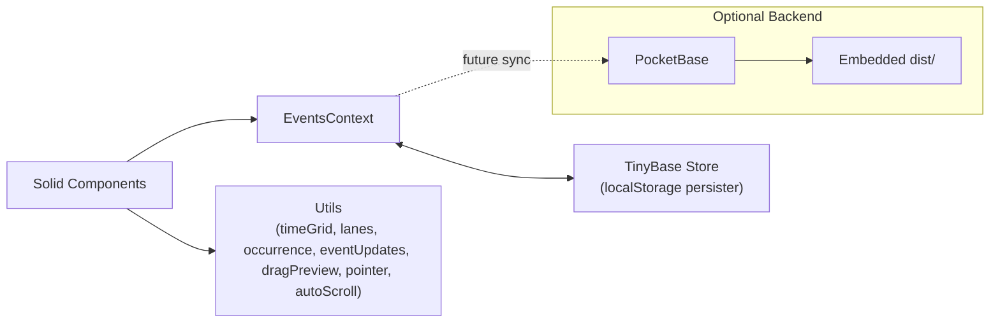

# Architecture

Folders
- `src/components` – presentational + interactive UI
- `src/context` – global app state (events, view, filters)
- `src/utils` – pure helpers and interaction primitives
- `src/data` – storage implementation (TinyBase)
- `backend` – PocketBase server for serving `dist/`
